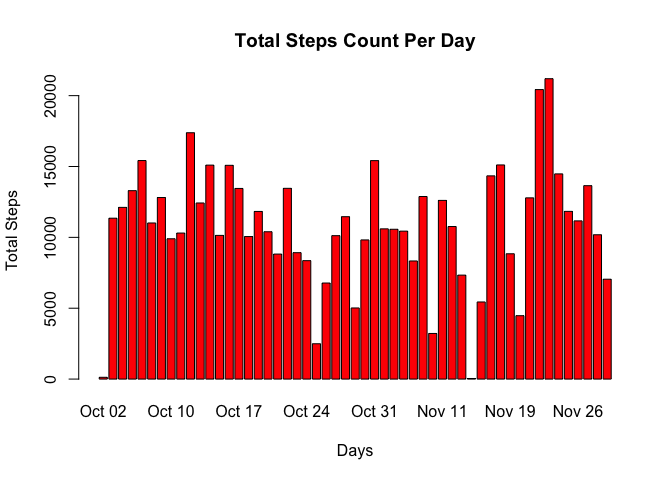
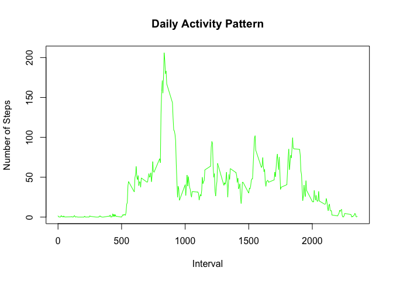
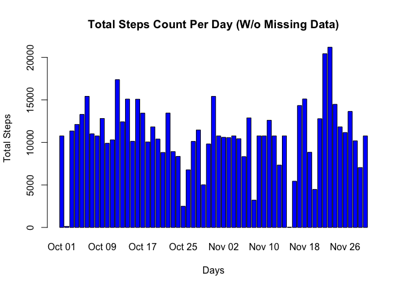
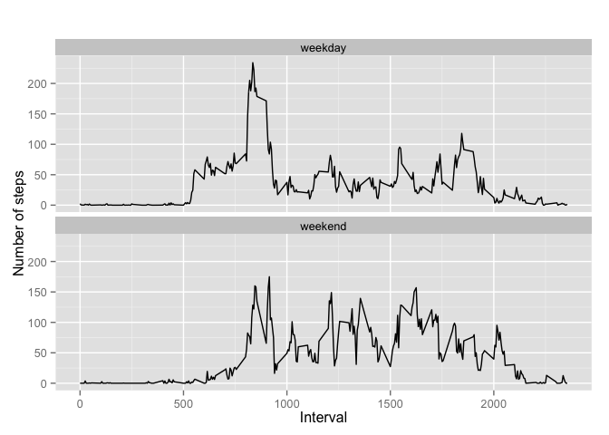

## Reproducible Research: Peer Assessment 1
### Loading and preprocessing the data  
The first step is to retrieve the data if the file doesn not currently exist and then unzip the data and read it into R.

```r
archiveFile <- "repdata-data-activity.zip"
if(!file.exists(archiveFile)) 
{archiveURL <- "https://d396qusza40orc.cloudfront.net/repdata%2Fdata%2Factivity.zip"
if(Sys.info()["sysname"] == "Darwin") {download.file(url=archiveURL,destfile=archiveFile,method="curl")} 
else {download.file(url=url,destfile=archiveFile)}}
```
In this step the file is unzipped and read into R.  

```r
unzip("repdata-data-activity.zip")
activity <- read.csv(file = "activity.csv")
```
The next step is to process the data, making it acceptable for further analysis. For this assignment, the data is properly parsed using the date string as a Date object.   

```r
activity$day <- factor(paste(substring(months(as.Date(activity$date)),0,3),
substring(as.Date  (activity$date), 9), sep=" "))
tidyData <- na.omit(activity)
head(tidyData)
```

```
##     steps       date interval    day
## 289     0 2012-10-02        0 Oct 02
## 290     0 2012-10-02        5 Oct 02
## 291     0 2012-10-02       10 Oct 02
## 292     0 2012-10-02       15 Oct 02
## 293     0 2012-10-02       20 Oct 02
## 294     0 2012-10-02       25 Oct 02
```

```r
activity$date <- as.Date(activity$date, format="%Y-%m-%d") 
```
### What is mean total number of steps taken per day?  
The next step is to summarize and plot the data to get steps per day.

```r
tot_steps <- aggregate(tidyData$steps, list(tidyData$date), FUN="sum")
names(tot_steps) <- c("date","total")
tot_steps$date <- factor(paste(substring(months(as.Date(tot_steps$date)),0,3), 
substring(as.Date  (tot_steps$date), 9), sep=" "))
barplot(tot_steps$total, names.arg=tot_steps$date, xlab="Days", ylab="Total Steps", main="Total Steps Count Per Day", col="red")
```

 
The plot shows a significant range of the number of steps per day over time.  There were a few days where there were limited number of steps taken.  The peak number of steps are shown toward end of November. 
Looking at the **mean** and **median** number of steps taken per day: 

```r
print(mean(tot_steps$total))
```

```
## [1] 10766.19
```

```r
print(median(tot_steps$total))
```

```
## [1] 10765
```
### What is the average daily activity pattern?  
First step to answer this question is to get the mean of steps.  

```r
activity_steps <- aggregate(tidyData$steps, list(as.numeric(tidyData$interval)), FUN="mean")
names(activity_steps) <- c("interval","mean")
```
This is then plotted at 5-minute intervals (x-axis) and the average number of steps taken, averaged across all days (y-axis):

```r
plot(activity_steps, type="l", xlab="Interval", ylab="Number of Steps", main="Daily Activity Pattern", col= "green")
```

 
### Which 5-minute interval, on average across all the days in the dataset, contains the maximum number of steps?
Find the row id, interval and mean of maximum average number of steps in a 5-minute interval. 

```r
maxStepInt <- activity_steps[which.max(activity_steps$mean),]
print(maxStepInt)
```

```
##     interval     mean
## 104      835 206.1698
```
### Imputing missing values  
There are a number of days/intervals where there are missing values (coded as `NA`). Missing values may introduce bias into some calculations or summaries of the data.  In order to understand the potenial impact of missing values it is important to calculate and report the total number of missing values in the dataset (i.e. the total number of rows with `NA`s):

```r
sum(is.na(activity$steps))
```

```
## [1] 2304
```
In order to fill in all missing values in the dataset, the calculated mean value for each interval can be used.  Now we have chosen a strategy, we create a new dataset that is equal to the original dataset but with the missing data filled in.

```r
tot_steps2 <- aggregate(steps ~ interval, data = activity, FUN = mean)
fillNA <- numeric()
for (i in 1:nrow(activity)) {obs <- activity[i, ]
        if (is.na(obs$steps)) {steps <- subset(tot_steps2, interval == obs$interval)$steps} 
        else {steps <- obs$steps}
        fillNA <- c(fillNA, steps)}
```
Next, create a data set that is equal the original dataset but with the missing data filled in with the fillNA data generated in the previous step.

```r
new_activity <- activity
new_activity$steps <- fillNA
```
Generate a histogram of the total number of steps taken each day and Calculate and report the mean and median total number of steps taken per day. The new values do not differ much from the estimates in the first part of the assignment.

```r
tot_steps2 <- aggregate(new_activity$steps, list(new_activity$date), FUN="sum")
names(tot_steps2) <- c("date","total")
tot_steps2$date <- factor(paste(substring(months(as.Date(tot_steps2$date)),0,3), substring(as.Date  (tot_steps2$date), 9), sep=" "))
barplot(tot_steps2$total, names.arg=tot_steps2$date, xlab="Days", ylab="Total Steps",main="Total Steps Count Per Day (W/o Missing Data)", col="blue")
```

 
Next step is to print the mean and median total steps without the missing data.  

```r
print(mean(tot_steps2$total)) 
```

```
## [1] 10766.19
```

```r
print(median(tot_steps2$total)) 
```

```
## [1] 10766.19
```
The new values are identical to each other and do not differ significantly from the original data.  
### Are there differences in activity patterns between weekdays and weekends?  
In order to plot differences it will be necessary to convert date string to Date class and distinguish between weekdays and weekends.  Once converted a dual plot showing weekdays and weekends will allow for the comparison of the two activity patterns.  

```r
library(ggplot2)
activity$date <- as.Date(activity$date, "%Y-%m-%d")
activity$day <- weekdays(activity$date)
activity$day_type <- c("weekday")
for (i in 1:nrow(activity)){
if (activity$day[i] == "Saturday" || activity$day[i] == "Sunday"){
activity$day_type[i] <- "weekend"
}}
activity$day_type <- as.factor(activity$day_type)
table_interval_steps_imputed <- aggregate(steps ~ interval+day_type, activity, mean)
qplot(interval, steps, data=table_interval_steps_imputed, geom=c("line"), xlab="Interval", 
      ylab="Number of steps", main="") + facet_wrap(~ day_type, ncol=1)  
```

 
Based on the results the number of steps achieved on the weekends is higher than steps achieved on the weekdays. 
